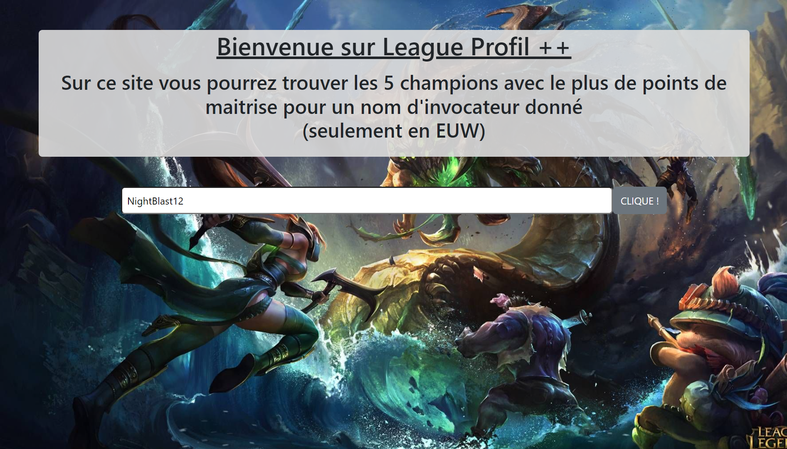
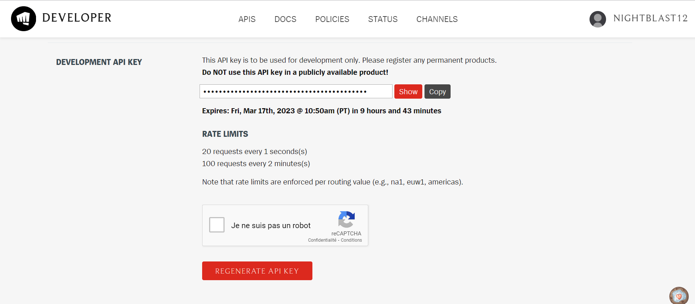
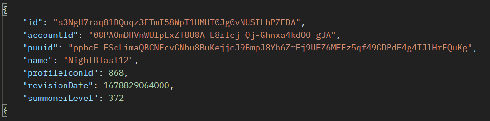
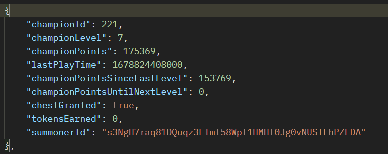

# League Pofil ++ (démo sans API)

**Note**

Ce site est une version démo qui ne fait pas de fetch direct sur les APIs mais qui fetch des json que j'ai rempli au préalable avec les APIs de Riot Games.
</br>
</br>

# Guide d'utilisation rapide
Voici à quoi devrait ressembler la page quand vous arrivez dessus :



Comme cette page est une version démo elle affichera toujours les informations pour le joueur "NightBlast12".

Il vous suffit juste d'appuyer sur le bouton et vous verrez les informations apparaitre.

# Les APIs
## Obtenir une clé API Riot

Rendez vous sur le <a href="https://developer.riotgames.com/">Riot Developper Portal</a> et connectez vous.

Une fois connecté, vous arriverez sur cette page :


Cliquez sur "Generate API Key" et elle apparaitra dans la zone au dessus. Elle sera valable 24 heures.

</br>

## Les APIs utilisées

### <b> Summoner-V4 </b>

La première API que j'ai utilisé est la <a href="https://developer.riotgames.com/apis#summoner-v4/GET_getBySummonerName">Summoner V4</a> dans la section "summoner name" qui me permet d'obtenir diverses informations sur un joueur à partir de son pseudo.

Voici comment écrire la requête :
``` javascript
`https://euw1.api.riotgames.com/lol/summoner/v4/summoners/by-name/${summonerName}?api_key=${apiKey}`
```

Voici un exemple de ce que retourne une requête sur cette API :



Ce qu'ils appellent "encrypted summoner id" sur le site de Riot API est la clé qui se trouve dans "id".
</br>
</br>

### <b> CHAMPION-MASTERY-V4 </b>

La deuxième API que j'utilise est la <a href="https://developer.riotgames.com/apis#champion-mastery-v4/GET_getAllChampionMasteries">Champion Mastery V4</a> que j'utilise avec les "encrypted summoner id" pour obtenir les informations concernant les mastery pour chaque champion pour le joueur qu'on cherche.

Voici comment écrire la requête :

``` javascript
`https://euw1.api.riotgames.com/lol/champion-mastery/v4/champion-masteries/by-summoner/${encrypted summoner id}?api_key=${apiKey}`
```

Voici un exemple de ce que retourne une requête sur cette API pour un seul champion :



Détails des lignes qui me sont utiles :
- ```championId``` : Id du champion à qui sont les infos.
- ```championLevel``` : Niveau de maitrise atteint sur le champion par le joueur.
- ```championPoints``` : Nombre de points totaux accumulés sur le champion.
</br>
</br>

### <b> Liste des champions </b>

J'ai ensuite dû fetch <a href="http://ddragon.leagueoflegends.com/cdn/13.5.1/data/en_US/champion.json">un json de la liste des champions</a> pour pouvoir retrouver les champions en fonction de leur IDs.
</br>
</br>

### <b>Liste des images des champions</b>

Pour obtenir les images des champions j'ai dû utiliser le lien suivant :

```
https://ddragon.leagueoflegends.com/cdn/13.5.1/img/champion/${Champion}.png
```
Voici le résultat si je veux afficher Ashe :


</br>

# Sources
- <a href="https://developer.riotgames.com/">Riot Developper Portal</a> pour obtenir une clé api et récupérer les requêtes à fetch.
- <a href="https://developer.riotgames.com/docs/lol">Riot Data Dragon</a> pour la documentation sur les APIs et certaines ressources comme la liste de champion.
- <a href="https://developer.mozilla.org/en-US/docs/Web/JavaScript">JavaScript | MDN</a> pour la documentation javascript.
- <a href="https://getbootstrap.com/docs/5.3/getting-started/introduction/">Bootstrap</a> pour la documentation sur les classes Bootstrap.